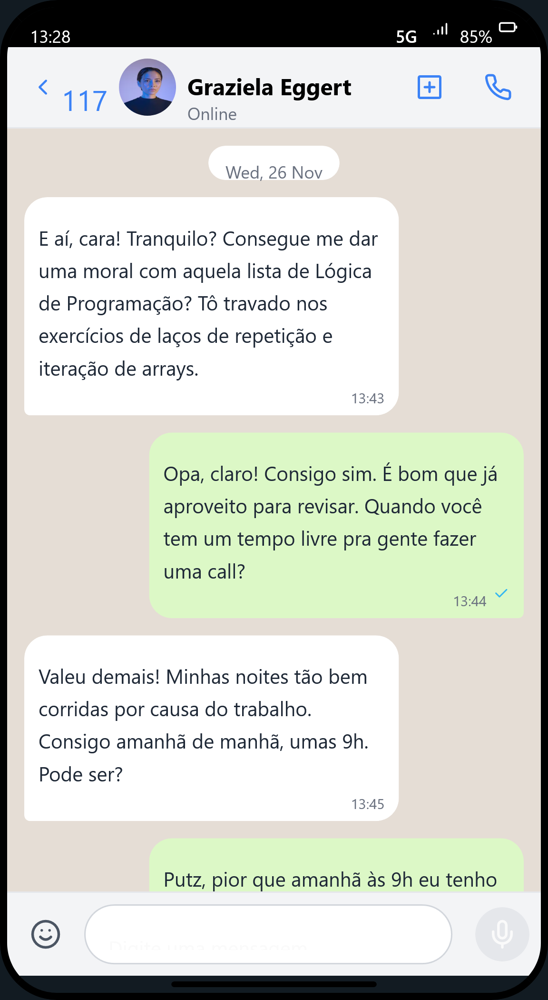
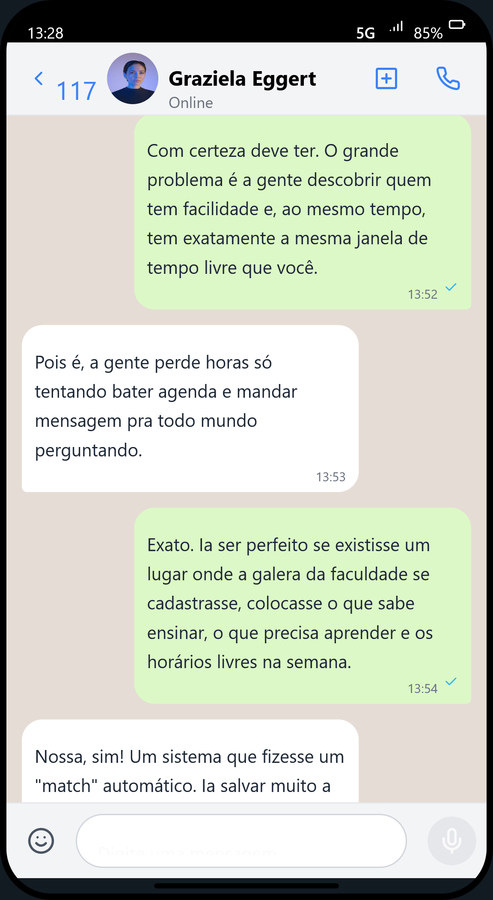
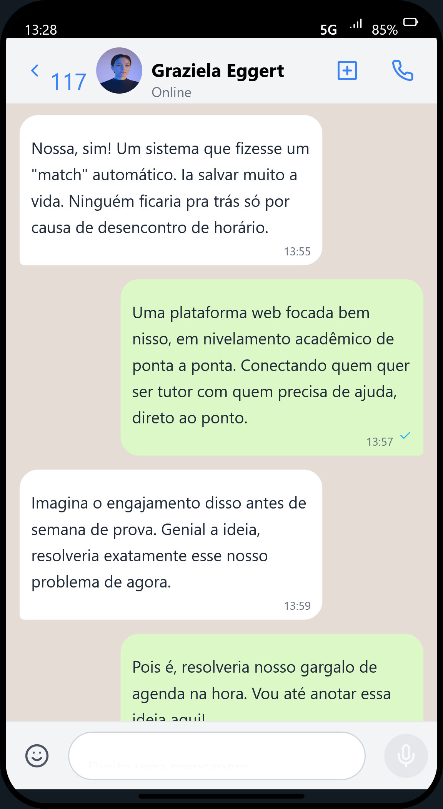
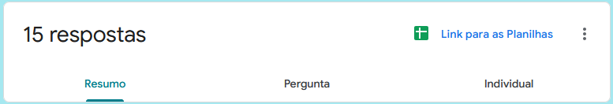
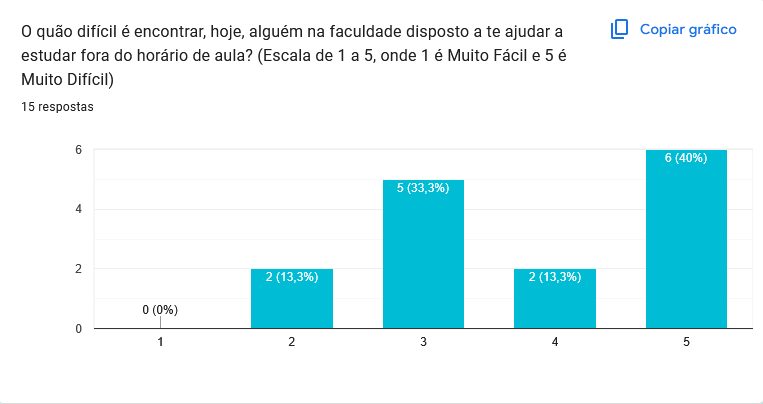
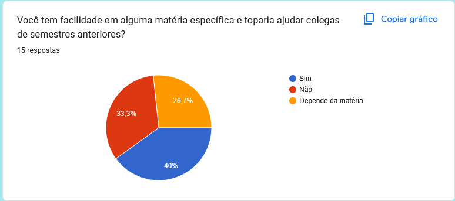
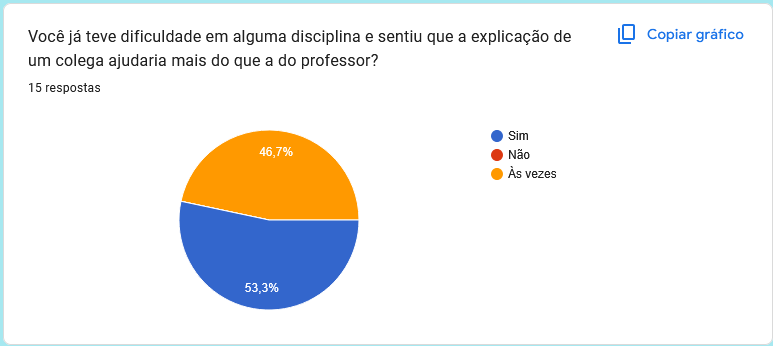
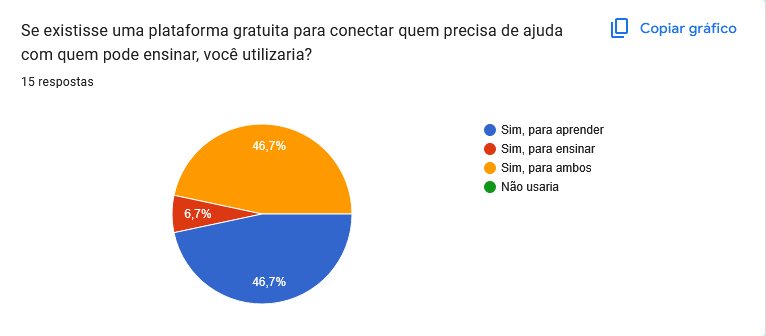
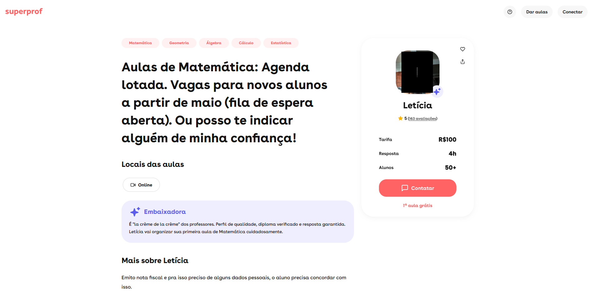

# RFC: Request for Comments — Projeto de Portfólio

**Engenharia de Software – Católica SC**

## Identificação
* **Título do Projeto:** LevelUp
* **Linha de Projeto (Direction):** Web 
* **Autor:** Henrique Maia Cardosa
* **Data da Proposta:** 26/03/2026
* **Versão:** 1.0

---

## 1. Visão do Produto e Impacto (O Problema)

### 1.1 Contexto e Problema
Atualmente o ambiente universitário apresenta altas taxas de retenção em disciplinas. O problema central reside na desconexão entre alunos que possuem dificuldades específicas (demanda) e alunos que possuem domínio dessas disciplinas e disponibilidade para ensinar (oferta).

Atualmente, essa dor é mitigada de forma ineficiente através de mensagens desestruturadas em grupos de WhatsApp ou pelo “boca a boca” onde alunos recomendam outros alunos que se destacam no curso, porém há problemas como horários rígidos, escassez de vagas (para alunos que querem aprender, e de alunos para ensinar) e falta de escalabilidade. A principal limitação do modelo atual é a falta de incentivo tangível para que os alunos de semestres avançados dediquem seu tempo livre para atuar como tutores informais, gerando um desequilíbrio no mercado de "dois lados" (muita demanda por aprendizado, baixa oferta de ensino voluntário).
> **Nota:** As imagens abaixo são meramente ilustrativas, porém servem para demonstrar um problema real. 

### 1.2 Origem da Demanda e Evidências
A demanda pela solução foi validada diretamente com a comunidade acadêmica, foco do impacto extensionista deste projeto.

**Pesquisa com Usuários:** Foi realizada uma pesquisa quantitativa via Google Forms com estudantes de graduação. O levantamento identificou um claro interesse no modelo de mentoria por pares, evidenciou tanto a vontade por aprender como o voluntariado para ensinar:

* **Dificuldade e preferência por ajuda de colegas:** 53,3% afirmaram que já tiveram dificuldades e sentem que a explicação de um colega ajudaria mais do que a do professor.
* **Disposição para ajudar:** 40% afirmaram que topariam ajudar colegas de semestres anteriores, enquanto 26,7% disseram que depende da matéria.
* **Dificuldade em encontrar ajuda hoje (Escala 1 a 5):** 40% avaliaram como "Muito Difícil" (5), e 33,3% avaliaram no nível 3.
* **Adoção da plataforma:** Caso existisse uma plataforma gratuita, 46,7% usariam para aprender, 46,7% usariam para ensinar, e 6,7% usariam para ambos.

**Solução da Demanda:** Para viabilizar o ecossistema, o projeto adotou a necessidade de inserir um motor de gamificação.

### 1.3 Análise de Soluções Existentes

| Solução Analisada | Pontos Fortes | Limitações | Diferencial da LevelUp |
| :--- | :--- | :--- | :--- |
| **1. Grupos de WhatsApp da Turma** | Acesso rápido; comunicação informal; alto alcance. | Caótico; informações se perdem; não gera histórico ou comprovação de horas para o tutor. | Geração de certificados automatizados de Horas Complementares; histórico de sessões em banco de dados estruturado. |
| **2. Plataformas como Superprof** | Excelente usabilidade; filtros de busca refinados; sistema de agendamento funcional. | Modelo de negócio 100% financeiro (B2C/C2C); focado em aulas pagas e inacessível para nivelamento comunitário universitário. | Arquitetura P2P comunitária sem transações financeiras; moeda de troca baseada em gamificação. |

> **Nota:** É possível verificar que as plataformas atuais requerem pagamento para a utilização da tutoria. A plataforma LevelUp, por sua vez, poderá ser utilizada por total voluntariado. 

### 1.4 Público-Alvo
* **Perfil Primário (Alunos de Graduação):** Jovens adultos, nativos digitais, matriculados na instituição. Possuem rotinas atarefadas (trabalho/estágio diurno e aulas noturnas), necessitando de ferramentas assíncronas ou horários alternativos para estudo.
* **Contexto de Uso:** Acesso majoritariamente via Web para agendamentos rápidos para sessões de estudo online ou consultas a materiais. Nível de conhecimento técnico médio a alto.

### 1.5 Objetivos do Projeto
* **Objetivo Geral:** Projetar e desenvolver uma aplicação Web estruturada que atue como uma plataforma *Peer-to-Peer* de conexões acadêmicas, utilizando gamificação para incentivar a redução da defasagem no aprendizado entre estudantes.

**Objetivos Específicos:**
* Desenvolver um motor de busca e *matchmaking* que cruze os dados de "Oferta" (matérias dominadas) e "Demanda" (matérias com dificuldade) dos usuários ativos.
* Implementar um fluxo completo de transação de agendamentos com máquina de estados (Pendente, Confirmada, Concluída).
* Construir um sistema lógico de gamificação (Créditos Virtuais e Leaderboard) que bloqueie alunos de apenas consumirem aulas sem retribuírem ensinando.
* Criação de atividades complementares ou provas por parte do tutor, para validar o aprendizado do ensinado.

### 1.6 Métricas de Sucesso (KPIs)

**Métricas Técnicas:**
* Alcançar cobertura de testes automatizados.
* Pipeline de CI/CD operando com sucesso no GitHub Actions realizando validação estática de código e segurança.

**Métricas de Produto/Negócio:**
* Validar a usabilidade com a execução bem-sucedida de pelo menos 4 a 5 fluxos completos de agendamento no ambiente de homologação/produção.
* Adoção de arquitetura escalável e documentação da API em conformidade para permitir futuras integrações (ex: app mobile).
